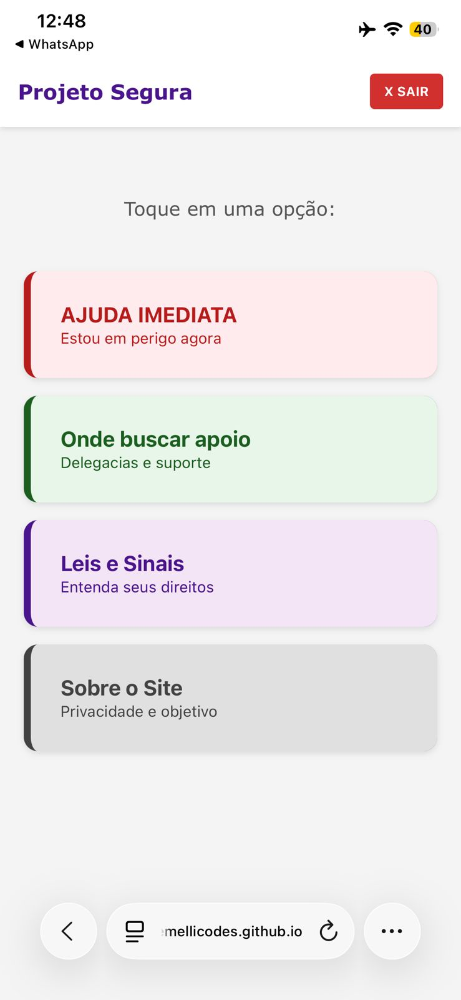
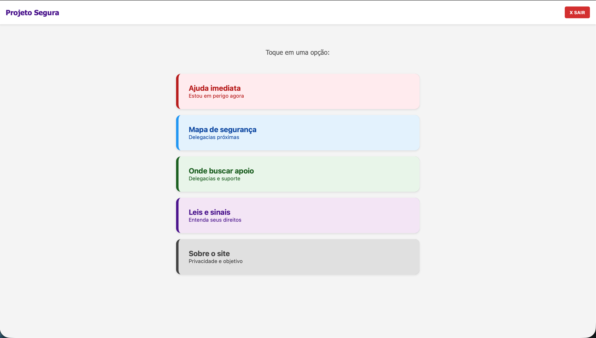
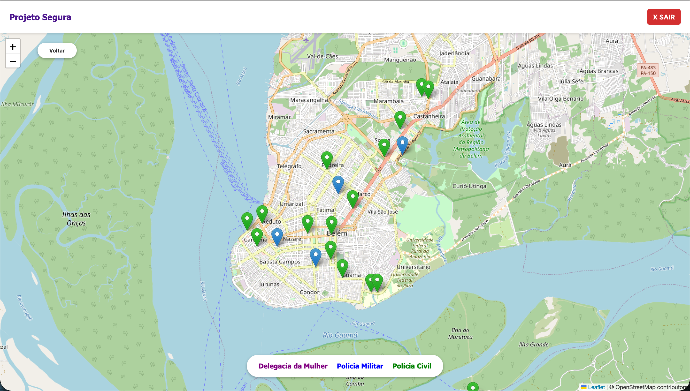

## PROJETO SEGURA

> Uma aplicação web focada em fornecer orientação rápida, discreta e segura para mulheres em situação de violência doméstica.


## Sobre o Projeto

O **Projeto Segura** é uma iniciativa educacional e preventiva. O objetivo é concentrar informações vitais (telefones de emergência, locais de apoio e direitos) em uma interface leve, rápida e que respeita a privacidade da usuária.

O diferencial é a acessibilidade: o site foi projetado para carregar instantaneamente, funcionar offline após o primeiro acesso e não deixar rastros de dados no servidor.

## Visualização do Projeto

A interface foi pensada para ser simples e direta, com foco principal no uso mobile.

### Tela Inicial

<div style="display: flex; align-items: flex-start; gap: 20px;">
  
  
</div>

### Nova Funcionalidade: Mapa de Segurança

<div style="display: flex; align-items: flex-start; gap: 20px;">
  
  
</div>

## Funcionalidades Principais

- **Botão de Pânico (Sair Rápido):** Um botão fixo no topo que redireciona imediatamente para o Google, caso a vítima precise esconder o site rapidamente.
- **Mapa de Segurança (Novo):** Utiliza geolocalização para mostrar delegacias próximas (DEAM, Civil e Militar) em tempo real, sem armazenar a localização da usuária.
- **Ajuda Imediata:** Acesso rápido aos discadores 190 (Polícia Militar), 197 (Polícia Civil) e 180 (Central de Atendimento à Mulher).
- **Informativo Jurídico:** Explicações simplificadas sobre a _Lei Maria da Penha_, _Lei do Feminicídio_ e os tipos de violência (física, psicológica, patrimonial, etc.).
- **Rede de Apoio:** Orientações sobre onde buscar ajuda presencial (DEAM, Defensoria Pública).
- **Privacidade:** Não utilizamos cookies de rastreamento e nenhum dado é salvo em banco de dados.

## Tecnologias Utilizadas

O projeto foi desenvolvido com tecnologias web nativas para garantir máxima compatibilidade e desempenho em qualquer dispositivo móvel:

- **HTML5** (Semântico e acessível)
- **CSS3** (Design responsivo e interface limpa)
- **JavaScript (Vanilla)** (Navegação SPA - Single Page Application - sem recarregamento de página)
- **OpenStreetMap & Overpass API** (Dados de geolocalização abertos e colaborativos)

## Como rodar o projeto localmente

Como é um projeto estático, não é necessário instalar dependências (npm, node, etc).

1. Clone este repositório:
   ```bash
   git clone https://github.com/semellicodes/projeto-segura.git
   ```
